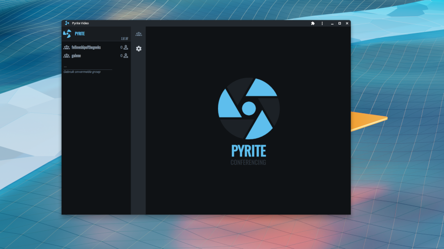

<br /><br />

<br />

# About

[Pyrite](https://pyrite.video) is a [FOSS](https://en.wikipedia.org/wiki/Free_and_open-source_software)
web-based video-conferencing client & management tool for the [Galène](https://github.com/jech/galene)
SFU. It consists of a [Vue 3](https://v3.vuejs.org/) UI and an [Express.js](http://expressjs.com/)
backend.

## Getting Started

```bash
cd ~/code
git clone https://github.com/jech/galene
cd galene
CGO_ENABLED=0 go build -ldflags='-s -w'
mkdir -p {data,groups,recordings}
./galene --insecure
```

```bash
npx @garage44/pyrite
```

```bash
[INFO] verifying configuration
[INFO] no settings file found; generate one...
? Path to Galène SFU: ~/code/galene
[INFO] config file written to: /home/you/.pyriterc
[INFO] writing initial users.json
[DEBUG] save new user b6676bd5-7d9a-4b91-b0e6-a8f0673d113c
[INFO] creating sfu config: /home/you/code/galene/data/config.json
[INFO] pyrite listening: 127.0.0.1:3030
```

### Developers

```bash
git clone git@github.com:garage44/pyrite.git
cd pyrite
npm i  # Install dependencies
npm run galene  # Run dockerized galene
# Uses Nodemon autoreload. Use PYRITE_NO_SECURITY=1 to bypass session security
nodemon admin/app.js
# Vite development server with proxy
npm run dev
```

## Documentation

Running Pyrite & Galène over a network requires additional configuration.
Checkout the [documentation](./docs/index.md) for more information.


