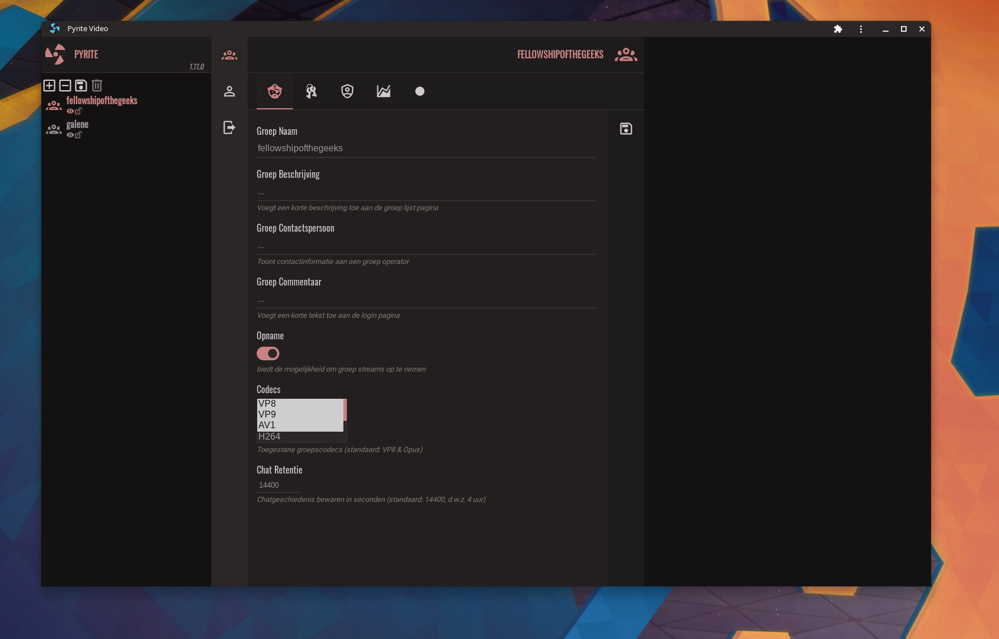

<br /><br />

<br />

[Galène](https://galene.org/) is a videoconference server (an “SFU”) that is easy to deploy and that
requires moderate server resources. [Pyrite](https://pyrite.video) is a web client (a replacement
for the default client) based on the [Vue](https://v3.vuejs.org/) framework. Besides the WebRTC
client, Pyrite also features an integrated Galène management UI.

Checkout Pyrite's [features](./docs/features.md) or read the documentation about
[deploying Pyrite](./docs/index.md) on a network.

## Installation

### Vanilla

```bash
git clone https://github.com/jech/galene
cd galene
CGO_ENABLED=0 go build -ldflags='-s -w'
mkdir -p {data,groups,recordings}
./galene --insecure
```

```bash
npx @garage44/pyrite
```

```bash
[INFO] verifying configuration
[INFO] no settings file found; generate one...
? Path to Galène SFU: ~/code/galene
[INFO] config file written to: /home/you/.pyriterc
[DEBUG] save new user b6676bd5-7d9a-4b91-b0e6-a8f0673d113c
[INFO] creating sfu config: /home/you/code/galene/data/config.json
[INFO] pyrite listening: 127.0.0.1:3000
```

### Docker

```bash
git clone https://github.com/garage44/pyrite
cd pyrite/docker
PYRITE_UID=1000 PYRITE_GID=1000 docker-compose up galene
```



